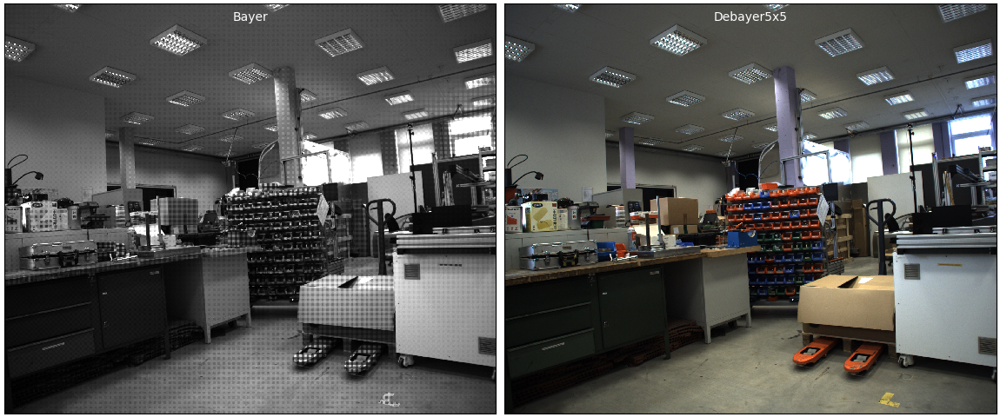
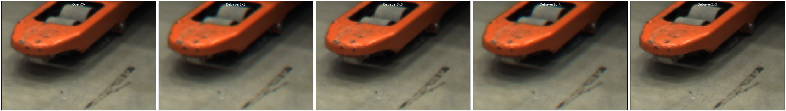
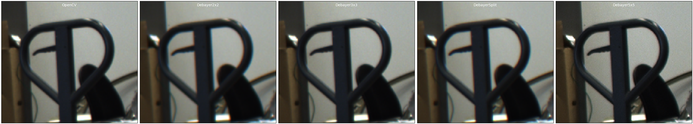
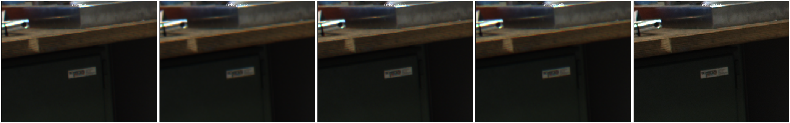
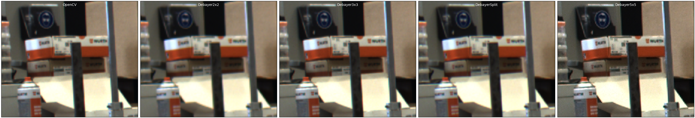

## pytorch-debayer

Provides GPU demosaicing of images captured with Bayer color filter arrays (CFA) with batch support. This implementation relies on pure PyTorch functionality and thus avoids any extra build steps.

Currently, the following methods are provided
 - `debayer.Debayer2x2` uses 2x2 convolutions. Trades speed for color accuracy.
 - `debayer.Debayer3x3` uses 3x3 convolutions. Slower but reconstruction results comparable with `OpenCV.cvtColor`.
 - `debayer.Debayer5x5` uses 5x5 convolutions based on Malver-He-Cutler algorithm. Slower but sharper than `OpenCV.cvtColor`.
 - `debayer.DebayerSplit` faster than Debayer3x3 but decreased image quality.

As of `v1.0.2` the method `debayer.Debayer5x5` should be used per default.

This library is most useful when downstream image processing happens with PyTorch models. Additionally the upload of Bayer images reduces the occupied bandwidth compared to color images.

### Usage
Usage is straight forward

```python
import torch
from debayer import Debayer5x5

f = Debayer5x5().cuda()

bayer = ...         # a Bx1xHxW, [0..1], torch.float32 BG-Bayer tensor
with torch.no_grad():
    rgb = f(bayer)  # a Bx3xHxW, torch.float32 tensor of RGB images
```

see [this example](debayer/apps/example.py) for elaborate code.

### Install
```
pip install git+https://github.com/cheind/pytorch-debayer
```

### Limitations

Currently **pytorch-debayer** requires
 - BG-Bayer color filter array layout. According to OpenCV naming conventions (see [here](https://docs.opencv.org/4.2.0/de/d25/imgproc_color_conversions.html) towards end of file) that means your Bayer input image must be arranged in the following way
 ```
RGRGRG...
GBGBGB...
RGRGRG...
.........
```
 - the number of image rows and columns to be even.

### Benchmarks
Performance comparison on a 5 megapixel [test image](etc/test.bmp) using a batch size of 10. 
Timings are in milliseconds per image. See [Benchmarks.md](./Benchmarks.md) for additional details.

Method | Device | Elapsed [msec/image] | Mode |
|:----:|:------:|:-------:|:----:|
| Debayer2x2 | GeForce GTX 1080 Ti | 0.653 | prec=torch.float32,time_upload=False |
| Debayer3x3 | GeForce GTX 1080 Ti | 3.056 | prec=torch.float32,time_upload=False |
| Debayer5x5 | GeForce GTX 1080 Ti | 6.343 | prec=torch.float32,time_upload=False |
| Debayer2x2 | GeForce GTX 1080 Ti | 0.562 | prec=torch.float16,time_upload=False |
| Debayer3x3 | GeForce GTX 1080 Ti | 2.812 | prec=torch.float16,time_upload=False |
| Debayer5x5 | GeForce GTX 1080 Ti | 4.545 | prec=torch.float16,time_upload=False |
| Debayer2x2 | NVIDIA GeForce RTX 3090 | 0.232 | prec=torch.float32,time_upload=False |
| Debayer3x3 | NVIDIA GeForce RTX 3090 | 1.173 | prec=torch.float32,time_upload=False |
| Debayer5x5 | NVIDIA GeForce RTX 3090 | 1.723 | prec=torch.float32,time_upload=False |
| Debayer2x2 | NVIDIA GeForce RTX 3090 | 0.173 | prec=torch.float16,time_upload=False |
| Debayer3x3 | NVIDIA GeForce RTX 3090 | 1.067 | prec=torch.float16,time_upload=False |
| Debayer5x5 | NVIDIA GeForce RTX 3090 | 1.687 | prec=torch.float16,time_upload=False |
| OpenCV 4.5.3 | Intel(R) Core(TM) i7-8700K CPU @ 3.70GHz | 2.097 | transparent_api=False,time_upload=False |
| OpenCV 4.5.3 | Intel(R) Core(TM) i7-8700K CPU @ 3.70GHz | 11.042 | transparent_api=True,time_upload=False |

### Comparisons

Here are some subjective image demosaicing results using the following [test image](etc/test.bmp) image. 
<div align="center">

</div>

The following highlights algorithmic differences on various smaller regions for improved pixel visibility. From left to right 
```
OpenCV, Debayer2x2, Debayer3x3, DebayerSplit, Debayer5x5
```

Click images to enlarge.

<div align="center">

</div>

<div align="center">

</div>

<div align="center">

</div>

<div align="center">

</div>

Created using
```
python -m debayer.apps.compare etc\test.bmp
# Then select a region and check `tmp`/
```